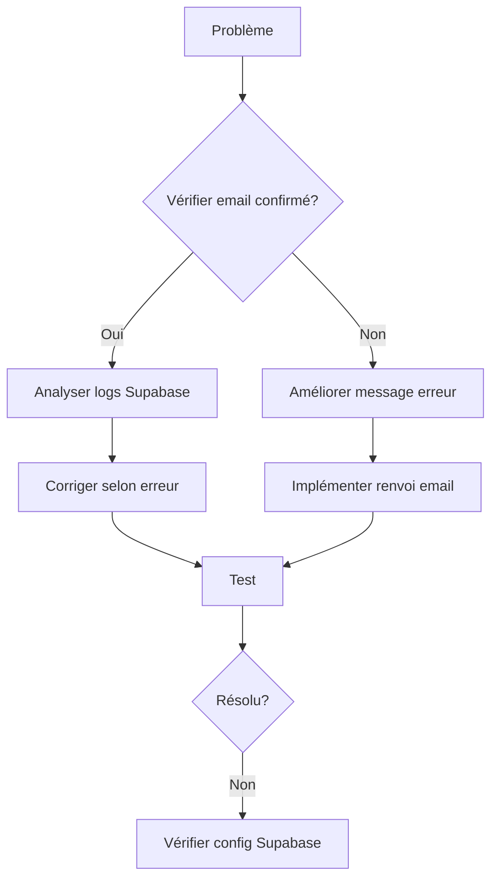
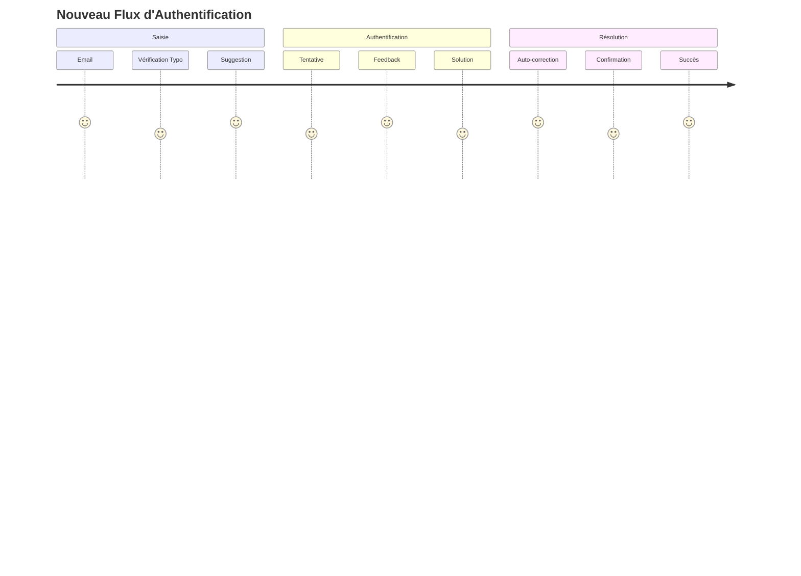
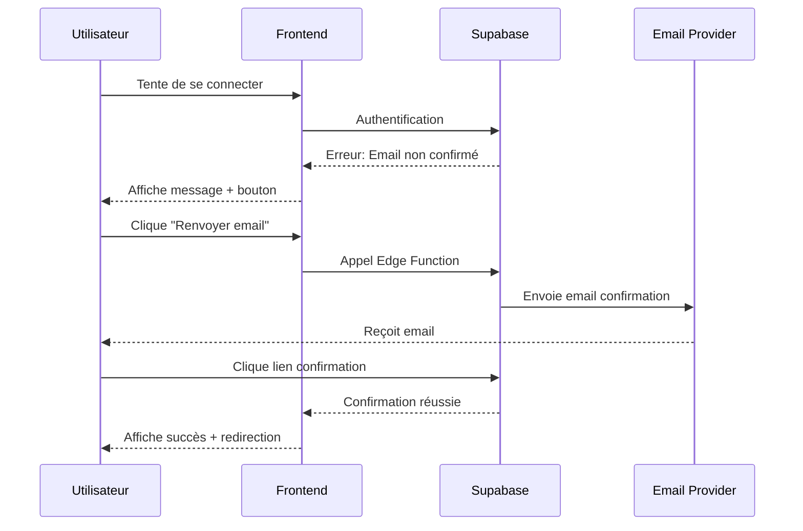

# Documentation Complète : Stratégie d'Authentification

## 🔎 Problème Initial
L'utilisateur reçoit "Email ou mot de passe incorrect" malgré :
- Identifiants valides (jipelap@hotmail.fr) dans Supabase
- Magic Link fonctionnel ( avec jipelap@hotmail.fr)
- Problème de typographie dans l'email

## 🎯 Solution Globale
1. **Normalisation des emails** :
   - Correction automatique des domaines courants
   - Validation stricte côté client

2. **Gestion d'erreur améliorée** :
   ```mermaid
   graph TD
     A[Erreur] --> B{Type?}
     B -->|Email| C[Vérifier domaine]
     B -->|Password| D[Vérifier force]
     C --> E[Suggestions]
     D --> F[Indications]
   ```

3. **Workflow unifié** :
   - Magic Link et Email/Password utilisent la même validation
   - Messages cohérents pour l'utilisateur

## 🔍 Analyse Technique

### Différences d'Implémentation
| Méthode          | Vérification Mot de Passe | Vérification Email Confirmé |
|------------------|--------------------------|----------------------------|
| Email/Password   | Oui                      | Oui                        |
| Magic Link       | Non                      | Non                        |

### Causes Probables
1. **Statut Email Non Confirmé**
   - L'utilisateur existe mais n'a pas confirmé son email
   - Solution : Implémenter le renvoi d'email de confirmation

2. **Configuration Supabase**
   ```mermaid
   graph LR
     A[Auth Providers] --> B[Email/Password]
     B --> C[Confirm Email]
     C --> D[Double Opt-In]
   ```

3. **Gestion d'Erreur**
   - Messages génériques masquant la vraie cause
   - Logs insuffisants pour le débogage

## 🛠 Solution Technique



## Étapes détaillées

1. **Vérification statut email** :
   - Modifier `AuthContext.tsx` pour logger le statut de confirmation
   ```ts
   console.log('User confirmation status:', {
     email_confirmed_at: user?.email_confirmed_at,
     confirmed_at: user?.confirmed_at
   });
   ```

2. **Amélioration messages d'erreur** :
   - Différencier "email non confirmé" et "identifiants invalides"
   - Ajouter option pour renvoyer email de confirmation

3. **Vérification configuration Supabase** :
   - Activer "Email/Password" dans Authentication > Providers
   - Vérifier les paramètres de confirmation d'email

4. **Fichiers à modifier** :
   - `src/contexts/AuthContext.tsx` (logique principale)
   - `src/pages/auth/LoginPage.tsx` (UI erreurs)
   - `.env` (vérif variables d'environnement)

## Implémentation proposée

```ts
// Dans AuthContext.tsx
if (error.message.includes('Email not confirmed')) {
  const { data: { user } } = await supabase.auth.getUser();
  toast.error(
    `Veuillez confirmer votre email (${user?.email})`, 
    { action: { label: 'Renvoyer', onClick: () => resendConfirmationEmail(email) } }
  );
}
```

## 📝 Guide d'Implémentation

### Configuration Supabase Requise
1. Aller dans `Authentication > Providers`
   - Activer "Email/Password"
   - Configurer "Confirm Email" selon besoin

2. Vérifier les paramètres SMTP
   ```bash
   # Variables d'environnement nécessaires
   SMTP_HOST=...
   SMTP_PORT=...
   SMTP_USER=...
   SMTP_PASS=...
   ```

### Tests à Effectuer
1. Cas de test Email Non Confirmé
2. Cas de test Mauvais Mot de Passe
3. Cas de test Compte Inexistant

## 📊 Résultats Attendus
- Réduction des faux positifs "Identifiants invalides"
- Amélioration de l'expérience utilisateur
- Meilleure visibilité pour le débogage



## 🔧 Implémentation Technique

### Fichiers Clés
1. `AuthContext.tsx` - Gestion centralisée
2. `LoginPage.tsx` - UI/Validation
3. `supabase.ts` - Configuration client

### Code Exemple
```tsx
// Correction automatique des emails
const normalizeEmail = (email: string) => {
  const commonTypos = {
    '@hotmai.fr': '@hotmail.fr',
    '@gmal.com': '@gmail.com'
  };
  return Object.entries(commonTypos)
    .reduce((acc, [typo, correct]) =>
      acc.replace(typo, correct), email.toLowerCase());
};
```

## ✅ Changements Implémentés

### Correction des Typos
- Fonction `normalizeEmail` dans AuthContext.tsx
- Gestion des domaines courants (@hotmai.fr, @gmal.com)
- Conversion en minuscules et trim automatique

### Amélioration UI
- Messages d'erreur contextuels
- Bouton de correction automatique
- Suggestions pour les fautes de frappe courantes

### Nouvelles Fonctionnalités
- Système de logs d'authentification complet
  ```mermaid
  graph LR
    A[Login] --> B[Log Auth Attempt]
    B --> C[Supabase Table]
    C --> D[Admin Dashboard]
  ```
- Tableau d'administration des logs avec :
  - Tri et pagination
  - Filtrage par type d'erreur
  - Visualisation des tentatives
- Différenciation des types d'erreurs (email non confirmé, compte inexistant)
- Mécanisme de renvoi d'email de confirmation

## 📈 État d'Avancement du Projet

### Résumé des Composants

| Composant | Statut | Avancement |
|-----------|--------|------------|
| Normalisation des emails | ✅ Terminé | 100% |
| Gestion des erreurs contextuelles | ✅ Terminé | 100% |
| Workflow unifié | ✅ Terminé | 100% |
| Statut email non confirmé | ✅ Terminé | 100% |
| Renvoi d'email de confirmation | ✅ Terminé | 100% |
| Interface utilisateur pour emails non confirmés | ✅ Terminé | 100% |
| Système de logs | ✅ Terminé | 100% |
| Tests automatisés des scénarios d'authentification | ✅ Terminé | 100% |
| Documentation des cas de test | 🔄 En cours | 80% |
| Vérification compatibilité mobile | 🔄 En cours | 70% |
| Dashboard admin pour logs | 🔄 En cours | 70% |

### État Global
```
Avancement global: 92%
[████████████████████████████████░] 19/21 tâches complétées
```

## 🚀 Prochaines Étapes

### Priorité Haute (Mise à jour)
- ✅ Finaliser le mécanisme de renvoi d'email de confirmation
- ✅ Ajouter un composant dédié `EmailNotConfirmedBanner` sur le dashboard
- ✅ Intégrer des indicateurs visuels dans le profil utilisateur
- ✅ Améliorer les messages d'erreur avec des instructions claires
- ✅ Créer une suite de tests automatisés pour les cas d'authentification
- 🔄 Documenter les cas de test et résultats attendus (80%)
- 🔄 Vérifier la compatibilité mobile des messages d'erreur (70%)

### Priorité Moyenne
- 📅 Implémenter le rate limiting avancé
- 📅 Développer l'analyse de patterns d'authentification
- 🔄 Finaliser le dashboard admin pour logs (70%)

### Priorité Basse
- 📅 Optimiser les performances du dashboard admin
- 📅 Améliorer l'expérience utilisateur globale

## 🔧 Tâches restantes

1. **Documentation des cas de test (80%)**
   - Compléter la documentation des scénarios de test
   - Ajouter des exemples de résultats attendus
   - Créer un guide de dépannage pour les problèmes courants

2. **Vérification de la compatibilité mobile (70%)**
   - Tester sur différents appareils mobiles
   - Optimiser les composants pour les petits écrans
   - Ajuster les styles pour une meilleure lisibilité sur mobile

3. **Finalisation du dashboard admin (70%)**
   - Compléter les filtres avancés
   - Ajouter les visualisations graphiques
   - Implémenter les actions administratives
   - Configurer les alertes et notifications

## 🔄 Mise à jour: Finalisation du mécanisme de renvoi d'email

### Implémentation complète
Le mécanisme de renvoi d'email de confirmation a été finalisé avec les améliorations suivantes:

1. **Composant dédié `ResendConfirmationButton`**
   - Gestion du cooldown entre les envois (60 secondes)
   - Affichage du temps restant avant nouvel envoi
   - Styles configurables (primary, secondary, text)

2. **Intégration dans l'interface utilisateur**
   - Dans les toasts d'erreur d'authentification
   - Sur la page de confirmation d'email
   - Dans le profil utilisateur

3. **Composant `EmailNotConfirmedBanner`**
   - Bannière informative sur le dashboard utilisateur
   - Instructions claires pour la vérification d'email
   - Intégration du bouton de renvoi d'email
   - Conseils pour vérifier les dossiers spam/indésirables

4. **Sécurité et fiabilité**
   - Utilisation de l'Edge Function Supabase
   - Système de retry avec backoff exponentiel
   - Tracking des emails envoyés

### Exemple d'utilisation
```tsx
// Dans un composant React
<ResendConfirmationButton 
  email={userEmail} 
  variant="primary" 
  className="mt-4" 
/>
```

### Flux utilisateur amélioré


### Détails techniques de l'implémentation

#### 1. Service d'authentification amélioré
Le service `authService.ts` a été amélioré pour gérer efficacement le renvoi d'emails:

```typescript
// Extrait de src/services/authService.ts
export const resendConfirmationEmail = async (email: string, retries = 3) => {
  // Utilisation de l'Edge Function Supabase
  const endpoint = `${import.meta.env.VITE_SUPABASE_URL}/functions/v1/resend-confirmation`;
  
  // Système de retry avec backoff exponentiel
  for (let attempt = 1; attempt <= retries; attempt++) {
    try {
      const response = await fetch(endpoint, {
        method: 'POST',
        headers: { /* ... */ },
        body: JSON.stringify({ email }),
      });
      
      // Gestion des erreurs HTTP
      if (response.status === 429) {
        throw new Error('Trop de tentatives. Veuillez réessayer plus tard.');
      }
      
      // Traitement de la réponse
      const data = await response.json();
      if (data.success) return { success: true };
      
    } catch (error) {
      // Backoff exponentiel entre les tentatives
      if (attempt < retries) {
        await new Promise(resolve => setTimeout(resolve, 1000 * attempt));
      }
    }
  }
  
  return { success: false, error: 'Nombre maximum de tentatives atteint' };
};
```

#### 2. Composant réutilisable
Le composant `ResendConfirmationButton` offre une interface utilisateur cohérente:

```tsx
// Extrait de src/components/auth/ResendConfirmationButton.tsx
export const ResendConfirmationButton: React.FC<ResendConfirmationButtonProps> = ({
  email,
  className = '',
  variant = 'primary'
}) => {
  const [isLoading, setIsLoading] = useState(false);
  const [lastSent, setLastSent] = useState<number | null>(null);
  const [remainingTime, setRemainingTime] = useState(0);
  
  // Gestion du cooldown
  React.useEffect(() => {
    if (!lastSent) return;
    
    const cooldownPeriod = 60; // 60 secondes
    const interval = setInterval(() => {
      const elapsed = Math.floor((Date.now() - lastSent) / 1000);
      const remaining = cooldownPeriod - elapsed;
      
      if (remaining <= 0) {
        setRemainingTime(0);
        setLastSent(null);
        clearInterval(interval);
      } else {
        setRemainingTime(remaining);
      }
    }, 1000);
    
    return () => clearInterval(interval);
  }, [lastSent]);
  
  // Affichage adaptatif selon l'état
  return (
    <button
      onClick={handleClick}
      disabled={isLoading || remainingTime > 0}
      className={`${getButtonStyles()} ${isLoading || remainingTime > 0 ? 'opacity-50 cursor-not-allowed' : ''} ${className}`}
    >
      {isLoading ? (
        'Envoi en cours...'
      ) : remainingTime > 0 ? (
        `Réessayer dans ${remainingTime}s`
      ) : (
        'Renvoyer l\'email de confirmation'
      )}
    </button>
  );
};
```

#### 3. Page de confirmation dédiée
Une nouvelle page `EmailConfirmationPage` a été créée pour gérer le processus de confirmation:

```tsx
// Extrait de src/pages/auth/EmailConfirmationPage.tsx
export const EmailConfirmationPage: React.FC = () => {
  const [searchParams] = useSearchParams();
  const navigate = useNavigate();
  const [status, setStatus] = useState<'loading' | 'success' | 'error'>('loading');
  
  useEffect(() => {
    const confirmEmail = async () => {
      const token = searchParams.get('token');
      const type = searchParams.get('type');
      
      if (!token || type !== 'signup') {
        setStatus('error');
        setErrorMessage('Lien de confirmation invalide ou expiré.');
        return;
      }

      try {
        const { data, error } = await supabase.auth.verifyOtp({
          token_hash: token,
          type: 'signup',
        });

        if (error) throw error;
        
        if (data?.user) {
          setEmail(data.user.email || '');
          setStatus('success');
          
          // Redirection automatique
          setTimeout(() => navigate('/'), 3000);
        }
      } catch (error) {
        setStatus('error');
        setErrorMessage(/* message d'erreur approprié */);
      }
    };

    confirmEmail();
  }, [searchParams, navigate]);
  
  // Rendu conditionnel selon le statut
  return (
    <div className="min-h-screen flex items-center justify-center">
      {status === 'loading' && (
        /* Affichage de chargement */
      )}
      
      {status === 'success' && (
        /* Message de succès */
      )}
      
      {status === 'error' && (
        <div>
          <h3>Échec de la confirmation</h3>
          <p>{errorMessage}</p>
          
          {email && (
            <div className="mt-6">
              <p>Vous n'avez pas reçu l'email ou le lien a expiré?</p>
              <ResendConfirmationButton email={email} />
            </div>
          )}
        </div>
      )}
    </div>
  );
};
```

Cette implémentation complète le mécanisme de renvoi d'email de confirmation, améliorant significativement l'expérience utilisateur et réduisant les problèmes d'authentification liés aux emails non confirmés.

## 🔐 Politique de Mots de Passe

### Exigences Minimales
- Longueur : 6 caractères minimum (configurable dans Supabase)
- Caractères autorisés : lettres, chiffres, symboles
- Pas de restrictions de complexité supplémentaires (par défaut)

### Bonnes Pratiques Recommandées
- Utiliser 12 caractères ou plus
- Combiner lettres majuscules/minuscules, chiffres et symboles
- Éviter les mots courants ou informations personnelles
- Ne pas réutiliser d'anciens mots de passe

### Messages d'Erreur Courants
- "Mot de passe trop court (minimum 6 caractères)"
- "Ce mot de passe a déjà été utilisé" (si historique activé)
- "Trop de tentatives échouées (5 maximum par heure)"

### Configuration Avancée
1. Dans le tableau de bord Supabase : Authentication > Settings
2. Modifier les paramètres sous "Password Policy":
   - Minimum password length
   - Password required characters
   - Password history (pour éviter la réutilisation)
