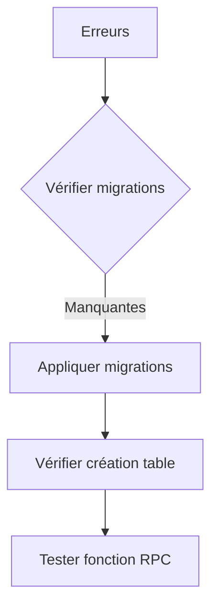

# Correctifs pour les erreurs Supabase

## Problèmes identifiés
1. **Erreurs 404** :
   - Table `auth_logs` manquante (résolu manuellement via SQL Editor)
   - Fonction RPC `table_exists` non disponible

2. **Erreur 400** :
   - Authentification échouée (potentiellement liée aux problèmes de migration)

## Solution technique

### 1. Application des migrations


Commandes à exécuter :
```bash
npx supabase migration up
npx supabase functions deploy
```

### 2. Contenu des migrations
**Fichier :** `202505271702_create_auth_logs.sql`
```sql
-- Crée la table de logs d'authentification
CREATE TABLE IF NOT EXISTS auth_logs (
  id BIGINT PRIMARY KEY GENERATED ALWAYS AS IDENTITY,
  email TEXT NOT NULL,
  status TEXT NOT NULL, -- 'attempt', 'success', 'failed'
  details JSONB,
  timestamp TIMESTAMP WITH TIME ZONE NOT NULL DEFAULT NOW(),
  -- ... autres colonnes
);
```

**Fichier :** `202506021953_add_table_exists_function.sql`
```sql
-- Crée la fonction de vérification de table
CREATE OR REPLACE FUNCTION table_exists(table_name TEXT) 
RETURNS BOOLEAN AS $$
-- ... implémentation PL/pgSQL
$$ LANGUAGE plpgsql SECURITY DEFINER;
```

### 3. Vérifications post-migration
1. Se connecter à l'interface Supabase
2. Vérifier que :
   - La table `auth_logs` existe dans l'onglet "Tables"
   - La fonction `table_exists` est listée dans "Functions"

### 4. Tests à effectuer
1. Tester la fonction RPC :
```javascript
const exists = await supabase.rpc('table_exists', { table_name: 'auth_logs' });
```
2. Vérifier les requêtes d'authentification

## Prochaines étapes
1. [x] Créer la table auth_logs (manuellement)
2. [ ] Appliquer la migration pour table_exists
3. [ ] Vérifier les permissions RPC
4. [ ] Tester le flux complet