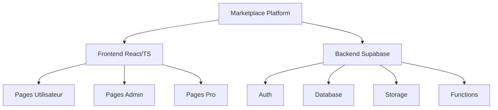
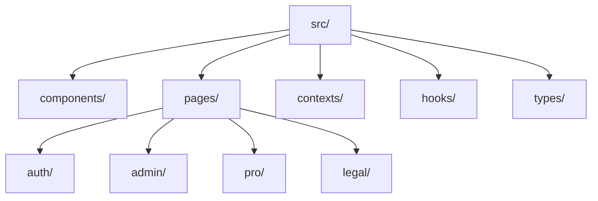
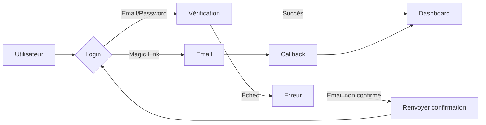
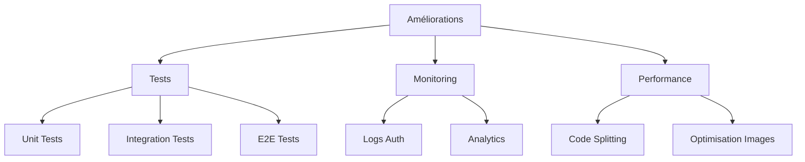
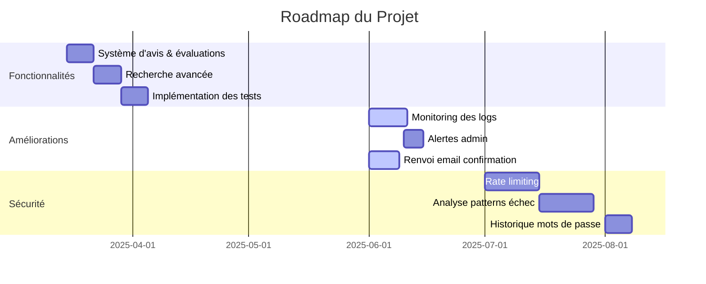
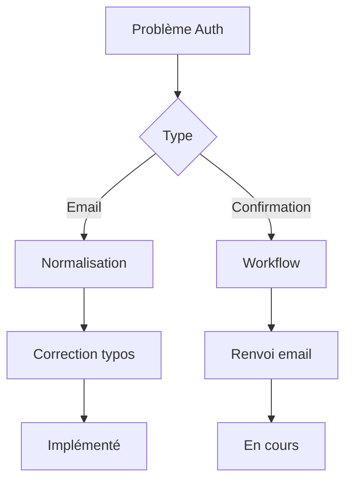

# Analyse Complète du Projet Marketplace

## 📊 Vue d'ensemble

Ce document présente une analyse complète de la plateforme Marketplace sous différentes perspectives: architecture, développement et gestion de produit.

## 🏗️ Architecture Logicielle

### Stack Technique

- **Frontend**: React avec TypeScript, Vite comme bundler
- **UI**: Tailwind CSS pour le styling
- **État**: React Query pour la gestion des données
- **Backend**: Supabase (PostgreSQL, Auth, Storage)
- **Paiements**: Intégration Stripe
- **Graphiques**: Chart.js avec react-chartjs-2
- **Formulaires**: react-hook-form

### Structure du Projet

### Flux d'Authentification

## 💻 Perspective Développeur

### Points Forts

1. **TypeScript** - Typage fort pour une meilleure maintenabilité
2. **React Query** - Gestion efficace des données côté client
3. **Tailwind CSS** - Styling cohérent et responsive
4. **Supabase** - Backend serverless avec authentification intégrée

### Défis Techniques

1. **Authentification** - Problèmes de normalisation des emails et de gestion des erreurs
2. **Migrations** - Erreurs 404/400 liées aux migrations Supabase
3. **Tests** - Implémentation prévue mais non complétée

### Améliorations Potentielles

## 📱 Fonctionnalités Principales

### Utilisateurs Standard

- Authentification (Email/Password, Magic Link)
- Gestion de profil
- Création et gestion d'annonces
- Messagerie
- Paiements via Stripe
- Watchlist

### Vendeurs Pro

- Dashboard avancé avec KPIs
- Abonnements premium
- Vérification KYC
- Statistiques de vente
- Graphiques d'analyse

### Administration

- Modération de contenu
- Gestion des signalements
- Tableau de bord administrateur
- Logs d'authentification
- Métriques de fraude

## 📈 Perspective Produit

### État Actuel

Le projet est une plateforme de marketplace complète avec des fonctionnalités pour:
- Acheteurs (recherche, messagerie, paiement)
- Vendeurs (publication d'annonces, statistiques)
- Vendeurs Pro (fonctionnalités premium)
- Administrateurs (modération, analytics)

### Roadmap

### Métriques Clés

- Vues des annonces
- Taux de conversion
- Chiffre d'affaires
- Croissance utilisateurs
- Activité de modération

## 🔒 Sécurité et Conformité

### Authentification

- Double authentification
- Confirmation d'email
- Normalisation des emails
- Gestion des erreurs contextuelles

### Modération

- Système de signalement
- Workflow de modération
- Logs d'actions

### Protection des Données

- RLS (Row Level Security) Supabase
- Politiques d'accès aux données
- Conformité RGPD (implicite)

## 🔍 Problèmes Identifiés et Solutions

### Authentification

Solution implémentée:
- Normalisation des emails
- Messages d'erreur contextuels
- Correction automatique des domaines courants

### Migrations Supabase

Problèmes:
- Table `auth_logs` manquante
- Fonction RPC `table_exists` non disponible

Solution:
- Application manuelle des migrations
- Vérification post-migration

## 🚀 Recommandations

1. **Priorité Haute**
   - Compléter l'implémentation des tests
   - Finaliser le système de renvoi d'email de confirmation
   - Implémenter la recherche avancée

2. **Priorité Moyenne**
   - Mettre en place le monitoring des logs
   - Développer le système d'avis et évaluations
   - Améliorer les graphiques d'analyse

3. **Priorité Basse**
   - Implémenter le rate limiting
   - Ajouter l'historique des mots de passe
   - Optimiser les performances

## 📝 Conclusion

La plateforme Marketplace est un projet bien structuré avec une architecture moderne et des fonctionnalités complètes. Les principaux défis concernent l'authentification, les migrations et les tests. La roadmap est claire avec des priorités bien définies pour les prochaines étapes de développement.